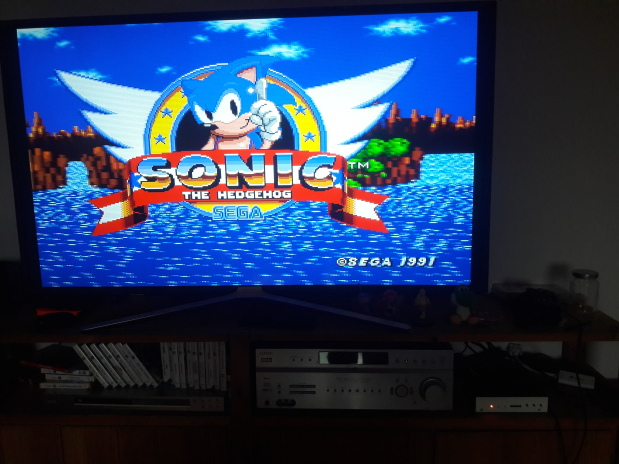

# MIST port of fpgagen - Genesis/Mega Drive core

This core implements a Sega Genesis/Mega Drive for the MIST.

The core's main features
  - Complete 68k and z80 CPU implementations
  - Video controller (VDP)
  - Stereo sound
  - Analog video output
    - VGA
    - SCART RGB (TV)
    - YPbPr component
  - 3/6 buttons controller support
  - SEGA Mouse
  - SVP chip for Virtua Racing (in separate downloadable core)

By now the core runs most games perfectly incl. the Titan Overdrive demo. Some games using
special and undocumented hardware features show visual or accousic artifacts or may not
run at all.

## Installing the core

Copy the following files to the root of your sdcard:
  - Copy the latest rbf file (i.e. fpgagen_20181026.rbf) and rename it core.rbf (or load it from the menu core)
  - Copy mist.ini - This remaps the controller buttons to Buffalo SNES, and you can customise
it to your controller.
  - Copy your .bin/.md/.gen cartridge images to the sdcard (preferrably into a genesis subdirectory)

## Backup RAM support

Many games allows to save game state or highscores to an on-cart battery backed SRAM chip. It is
also usable with the core with some preparation:

  - Create an empty file on the SD-Card with .sav extension. The maximum size of the save ram can be
32k, so it's safe to create a file with 32768 byte size. Another option to use an existing save file
from an emulator, e.g. BlastEm's sram files are working.
  - After loading the game ROM, choose "Mount SAV" from the OSD, and select the previously created file.
The yellow LED will lit, indicating that the backup file is loaded.
  - Before you load a new ROM, or turn off the MiST, don't forget to write back the contents of the
backup RAM to the SD-Card via the "Write Save RAM" OSD option. You can only write back the SRAM contents
when the yellow led lit!
  - Note: only normal RAM type backup devices are working, EEPROM is still fake.
  - A list of carts with backup RAM support, with the type of the storage can be found at
https://forum.digitpress.com/forum/showthread.php?134961-NES-SNES-Genny-Games-with-Battery-Back-up-Save-feature&p=1614576&viewfull=1#post1614576

**If you're using the Backup RAM feature, for safety of your filesystem on the SD-Card, use at least 
[firmware version 20190110](https://github.com/mist-devel/mist-binaries/blob/master/firmware/firmware_190110.upg)**

## Some usage tips

  1. The core rquires at least firmware version 20181013.
  2. Rom file formats supported are .bin and .gen, no support for .smd files
  3. If the controls seems to not work, try switch to 3 buttons mode in the OSD
  4. Includes support for [YPbPr cables](https://github.com/mist-devel/mist-board/wiki/YPbPr_Cable)
  5. Some carts have an SRAM or EEPROM to allow saving game states. SRAM is always enabled at 2MB (if
     the cart size < 2MB, or the game uses bank switching to page in), and you can turn on a "fake"
     EEPROM at 2MB in the OSD. For example, it allows NBA Jam TE to run. Note: use "Fake EEPROM"
     option only on games which require it, because its control address can clash with the normal cart ROM.
  6. SVP version is only for Virtua Racing!

## Contributors

  - [Original core by Torlus](https://github.com/Torlus/fpgagen)
  - [TG68K CPU core by Tobias Gubener](https://opencores.org/project/tg68)
  - [FX68K CPU core by Jorge Cwik](https://github.com/ijor/fx68k)
  - [T80 CPU core by Daniel Wallner](https://opencores.org/project/t80/overview)
  - [Initial MIST port by Robinsonb5](https://github.com/robinsonb5/fpgagen)
  - [JT12 YM2612 sound core by Jose Tejada](https://github.com/jotego/jt12)
  - [Improvements by Gyurco](https://github.com/gyurco/fpgagen)
  - [Improvements by Sorgelig](https://github.com/MiSTer-devel/Genesis_MiSTer)
  - and many more ...

## Thanks to the members/authors of

  - [SpriteMind.net forum](http://gendev.spritesmind.net/forum/) for lot of valuable information
  - [Exodus emulator](https://www.exodusemulator.com/) for its great debugger
  - [BlastEm emulator](https://www.retrodev.com/blastem/) for allowing to look into the source code of the most accurate Genesis emulator
