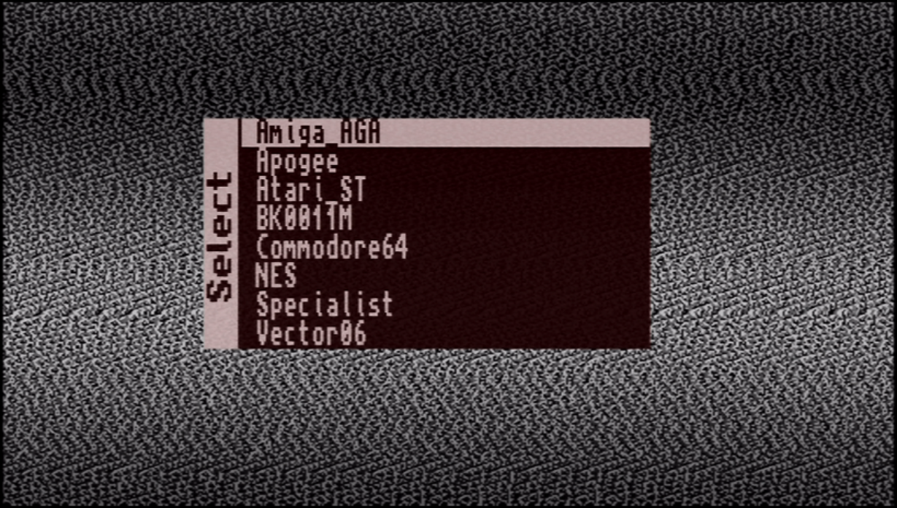

## It's a simple startup core to display menu.

Put [this core](https://github.com/sorgelig/Menu_MIST/tree/master/release) to the root of SD card with name **core.rbf**. It will be loaded automatically upon MIST startup and menu will be displayed. 

### Background image

A BMP file with the dimensions of 512x312 and 32 bit color depth can be added as a background image. Just upload this BMP as MENU.ROM to the root of the SD Card.