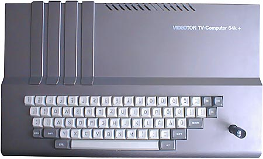

# Videoton TV Computer

The TV Computer (TVC) was manufactured by the Hungarian company Videoton between 1986 and 1989.

The FPGA core originally written by Jozsef Laszlo. The original website is http://joco.homeserver.hu/.

The additions to the original core:
- Rewritten some parts to synchronous code.
- Updated the various components, like the T80 CPU and MC8645 CRTC.
- Cartridge and FDC support.
- Some additional fixes, like digi sound is working now.
- 15kHz (original) and 31kHz(scandoubled) video outputs are supported in one core.

More information about the machine can be found at: http://tvc.homeserver.hu/. The website is mostly Hungarian, but there's an English section, too.

## Usage

The above website has a comprehensive collection of user manuals, however due to the origin of the machine, they're mostly Hungarian,
so here are some instructions about the usage of the disk system.

The disk controller interface (HBF) has a built in ROM and RAM, which provides an extension to the BASIC. Tape commands are redirected to the disk.

Some usage samples:

**LOAD "START.CAS"** will load the START.CAS file from the disk

**EXT 2** goes into the DOS CLI. **ESC** can be used to return to BASIC.

Some commands in the DOS CLI:

**HELP** lists all commands available

**DIR** directory list

**TYPE filename** displays the specificed file on the screen

**DOS** invokes the full-fledged VT-DOS system, if the VT-DOS cartridge is loaded.
